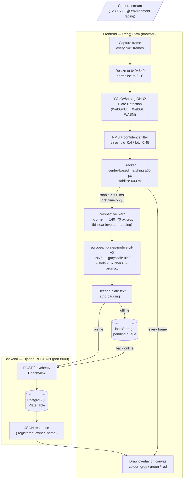

# Park Check — Licence Plate Enforcement App

A Progressive Web App for parking enforcement officers. Point the phone camera at a vehicle; the app detects the licence plate in real time, reads the text on-device, and checks it against a registered-plates database — all without leaving the camera view.

---

## Table of Contents

1. [Architecture Overview](#architecture-overview)
2. [Dataflow Diagram](#dataflow-diagram)
3. [Services](#services)
   - [Frontend (React PWA)](#frontend-react-pwa)
   - [Backend (Django REST API)](#backend-django-rest-api)
   - [Database (PostgreSQL)](#database-postgresql)
4. [AI Pipeline](#ai-pipeline)
5. [API Reference](#api-reference)
6. [Data Models](#data-models)
7. [Configuration](#configuration)
8. [Running Locally](#running-locally)

---

## Architecture Overview

```
┌─────────────────────────────────────────────────────────┐
│                    Officer's Device                      │
│                                                          │
│   ┌──────────────────────────────────────────────────┐  │
│   │              React PWA (port 5173)               │  │
│   │                                                  │  │
│   │  Camera → Detection (ONNX/WebGPU) → Tracker      │  │
│   │                   ↓                              │  │
│   │          Warp → OCR (ONNX/WASM)                  │  │
│   │                   ↓                              │  │
│   │          POST /api/check/  ──────────────────────┼──┼──→ Django (port 8000)
│   │                                                  │  │          ↓
│   └──────────────────────────────────────────────────┘  │     PostgreSQL (port 5432)
└─────────────────────────────────────────────────────────┘
```

All inference runs **in the browser** (WebGPU when available, WebGL or WASM as fallback). The backend is only contacted for the final registration lookup and for plate management.

---

## Dataflow Diagram



### Phase-by-phase timing (typical mobile device)

| Phase | Typical latency |
|---|---|
| Preprocess (resize + normalise) | ~5 ms |
| ONNX inference (WebGPU) | ~30–80 ms |
| NMS + postprocess | ~2 ms |
| Tracker update | <1 ms |
| Perspective warp | ~3 ms |
| OCR inference (WASM) | ~15–40 ms |
| Backend check (network) | ~20–100 ms |

---

## Services

### Frontend (React PWA)

| Detail | Value |
|---|---|
| Framework | React 18 + Vite 5 |
| Styling | Tailwind CSS |
| Routing | React Router 6 |
| Inference runtime | ONNX Runtime Web (`onnxruntime-web`) |
| Execution providers | WebGPU → WebGL → WASM (auto-selected) |
| Offline support | Workbox (PWA) + `localStorage` pending queue |
| Port | 5173 (HTTPS via mkcert) |

**Key source files:**

| File | Role |
|---|---|
| `src/pages/Check.jsx` | Camera loop, tracker integration, overlay drawing |
| `src/utils/detector.js` | YOLOv8 preprocessing + perspective warp |
| `src/utils/ocr.js` | OCR model inference + character decoding |
| `src/utils/tracker.js` | Multi-plate center-based tracker |
| `src/utils/modelRegistry.js` | ONNX session management, global inference lock |
| `src/utils/detectorCore.js` | Perspective transform math, NMS |
| `src/context/AuthContext.jsx` | JWT token lifecycle |
| `src/api/client.js` | Axios instance with Bearer token injection |
| `src/config.js` | Tunable detection/tracking constants |

**Detection & tracking constants (`src/config.js`):**

```js
FRAME_SKIP          = 2      // run detection every 2nd frame
CAMERA_WIDTH        = 1280
CAMERA_HEIGHT       = 720
STABILIZER_DELAY_MS = 600    // plate must be stable for 600 ms before OCR fires
STABILIZER_TOLERANCE = 60    // centre may drift ≤60 px and still count as stable
DETECTION_THRESHOLD  = 0.4   // minimum confidence to accept a detection
NMS_IOU_THRESHOLD    = 0.45  // IoU threshold for non-maximum suppression
RESULT_DISPLAY_MS    = 3000  // ms to show a result label
```

---

### Backend (Django REST API)

| Detail | Value |
|---|---|
| Framework | Django 4.2 + Django REST Framework 3.15 |
| Auth | SimpleJWT (access + refresh tokens) |
| Python | 3.12 |
| Port | 8000 |

**Endpoint summary:**

| Method | Path | Auth | Description |
|---|---|---|---|
| `POST` | `/api/auth/token/` | — | Obtain JWT access + refresh tokens |
| `POST` | `/api/auth/token/refresh/` | — | Refresh access token |
| `GET` | `/api/plates/` | Officer | List all registered plates |
| `POST` | `/api/plates/` | Officer | Register a new plate |
| `PATCH` | `/api/plates/{id}/` | Officer | Update plate details |
| `DELETE` | `/api/plates/{id}/` | Officer | Remove a plate |
| `GET` | `/api/users/` | Admin | List enforcement users |
| `POST` | `/api/check/` | Officer | Check if a plate text is registered |

**Key source files:**

| File | Role |
|---|---|
| `api/models.py` | `User`, `Plate`, `TestResult` models |
| `api/views.py` | `PlateViewSet`, `UserViewSet`, `CheckView` |
| `api/serializers.py` | DRF serializers |
| `api/urls.py` | URL routing |
| `api/admin.py` | Admin with test-result image viewer |
| `config/settings.py` | Django settings (DB, CORS, JWT, auth) |
| `eval/` | OCR + detection accuracy evaluation scripts |

---

### Database (PostgreSQL)

PostgreSQL 16. Data persisted in a named Docker volume (`postgres_data`). Connection settings injected via environment variables.

---

## AI Pipeline

All inference runs in the browser. No image data is sent to the server — only the decoded plate text string.

### 1. Plate Detection — YOLOv8n Segmentation

- Model: `yolov8n-seg` exported to ONNX
- Input: `[1, 3, 640, 640]` float32, normalised to `[0, 1]`
- Output 0: `[1, 37, N]` — detection candidates (bbox + confidence + 32 mask coefficients)
- Output 1: `[1, 32, H, W]` — prototype masks
- Post-processing: NMS (IoU ≥ 0.45, confidence ≥ 0.4), extracts 4 corner points per plate

### 2. Perspective Warp

- Input: original video frame + 4 corner coordinates from segmentation
- Algorithm: compute 3×3 homography via `getPerspectiveTransform`; apply inverse mapping with bilinear interpolation
- Output: `140 × 70 px` perspective-corrected plate crop

### 3. OCR — european-plates-mobile-vit-v2

- Model: `european-plates-mobile-vit-v2` (MobileViT-based, ONNX)
- Input: `[1, 70, 140, 1]` uint8 grayscale (BT.601 luma)
- Output: `[1, 333]` = 9 character slots × 37 classes (multi-head softmax)
- Alphabet: `0–9 A–Z _` (`_` = padding)
- Decoding: argmax per slot, strip `_` padding characters

### 4. Multi-Plate Tracker

The `Tracker` class matches detections across frames without needing a full Kalman filter:

- **Matching:** nearest-centre Euclidean distance, threshold = 60 px
- **Stabilisation:** OCR fires once when a plate has been continuously tracked for ≥ 600 ms
- **Miss tolerance:** track is dropped after 2 consecutive missed frames
- **Overflow guard:** if > 6 simultaneous tracks are detected, all tracks are cleared (camera confusion)
- **Post-result anchor sliding:** after OCR fires, the track anchor follows the plate so it doesn't drift out of range

### 5. Offline Mode

When the device is offline, the decoded plate text is saved to `localStorage` (`parkcheck_pending`). When connectivity is restored a `window online` event triggers a sync loop that retries all pending checks.

---

## API Reference

### `POST /api/check/`

Check whether a plate is registered. This is the core enforcement endpoint.

**Request**
```json
{ "plate_text": "ABC123" }
```

**Response — registered**
```json
{
  "plate_text": "ABC123",
  "registered": true,
  "owner_name": "John Smith"
}
```

**Response — not registered**
```json
{
  "plate_text": "XYZ999",
  "registered": false,
  "owner_name": ""
}
```

### `POST /api/auth/token/`

**Request**
```json
{ "username": "officer1", "password": "secret" }
```

**Response**
```json
{ "access": "<jwt>", "refresh": "<jwt>" }
```

---

## Data Models

### User

| Field | Type | Notes |
|---|---|---|
| `id` | int | PK |
| `username` | str | Django default |
| `password` | str | hashed |
| `badge_number` | str (32) | unique, nullable |
| `is_staff` | bool | admin access |

### Plate

| Field | Type | Notes |
|---|---|---|
| `id` | int | PK |
| `plate_number` | str (16) | unique, normalised (uppercase alphanumeric) |
| `owner_name` | str (128) | optional |
| `notes` | text | optional |
| `is_active` | bool | soft-delete flag |
| `created_at` | datetime | auto |
| `updated_at` | datetime | auto |

---

## Configuration

All runtime configuration is provided via environment variables (`.env` file at project root).

| Variable | Default | Description |
|---|---|---|
| `POSTGRES_DB` | `parkcheck` | Database name |
| `POSTGRES_USER` | `parkcheck` | Database user |
| `POSTGRES_PASSWORD` | `parkcheck` | Database password |
| `POSTGRES_HOST` | `db` | Docker service name |
| `DJANGO_SECRET_KEY` | `dev-secret-key-...` | Django secret — change in production |
| `DEBUG` | `1` | Set to `0` in production |

---

## Running Locally

**Prerequisites:** Docker, Docker Compose 1.29+, mkcert (for HTTPS in the browser — required for camera API)

```bash
# 1. Clone and enter the project
git clone <repo-url>
cd park-check-app-thesis

# 2. Copy and edit environment variables
cp .env.example .env

# 3. Start all services
docker-compose up --build

# 4. Create a superuser (first time only)
docker-compose exec web python manage.py createsuperuser
```

| Service | URL |
|---|---|
| Frontend | https://localhost:5173 |
| Backend API | http://localhost:8000/api/ |
| Django Admin | http://localhost:8000/admin/ |
| Database | localhost:5432 |
