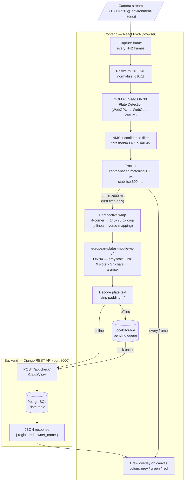
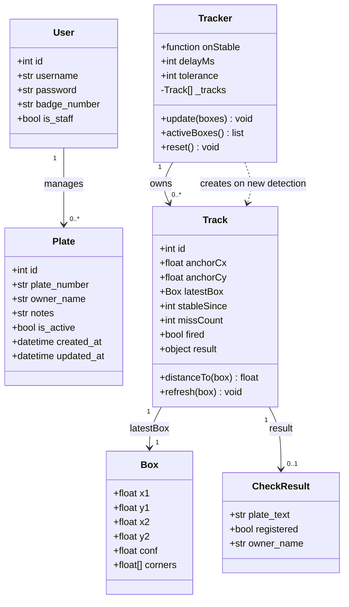

# Park Check — Licence Plate Enforcement App

A Progressive Web App for parking enforcement officers. Point the phone camera at a vehicle; the app detects the licence plate in real time, reads the text on-device, and checks it against a registered-plates database — all without leaving the camera view. All inference runs in the browser (WebGPU → WebGL → WASM). The backend is only contacted for the final registration lookup.

---

## Dataflow

---

## Object Diagram

