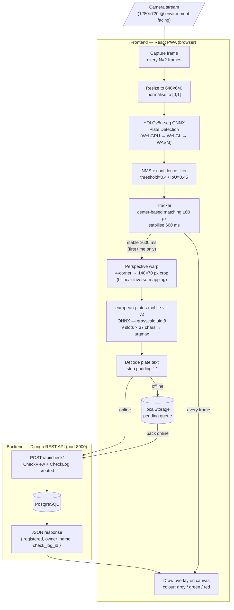
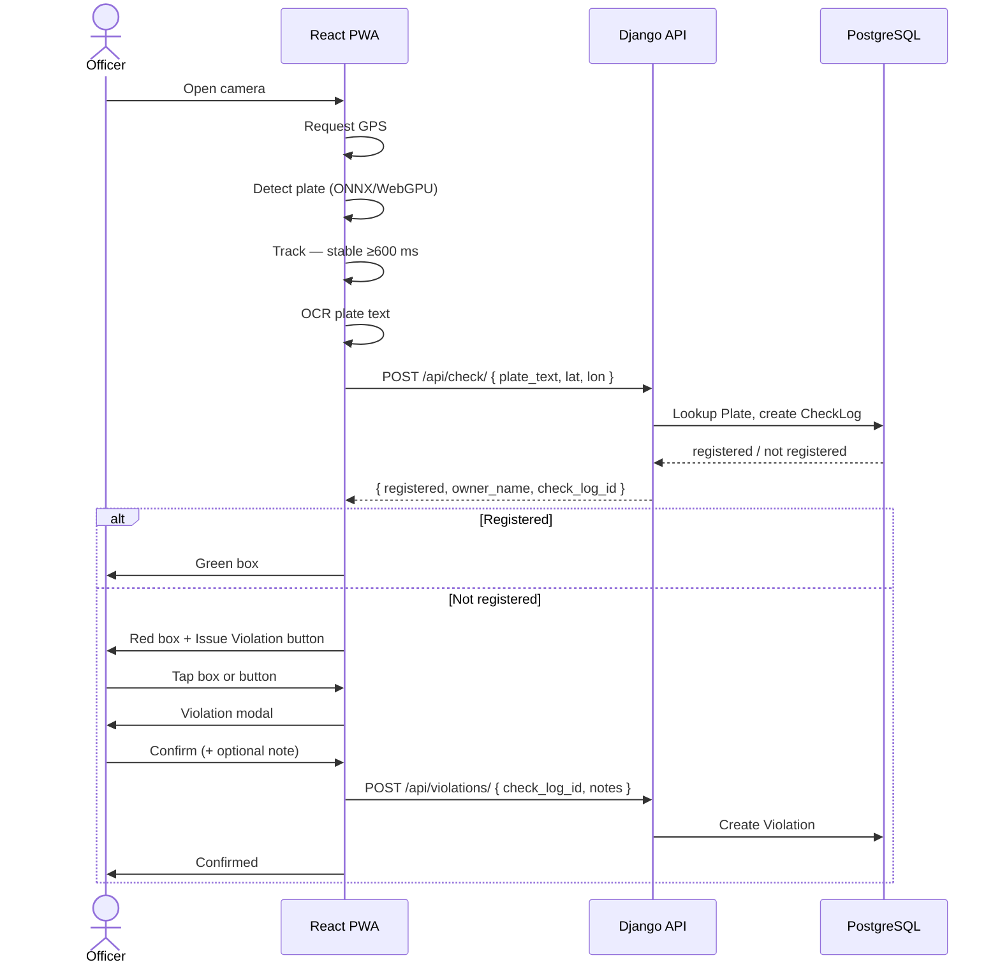
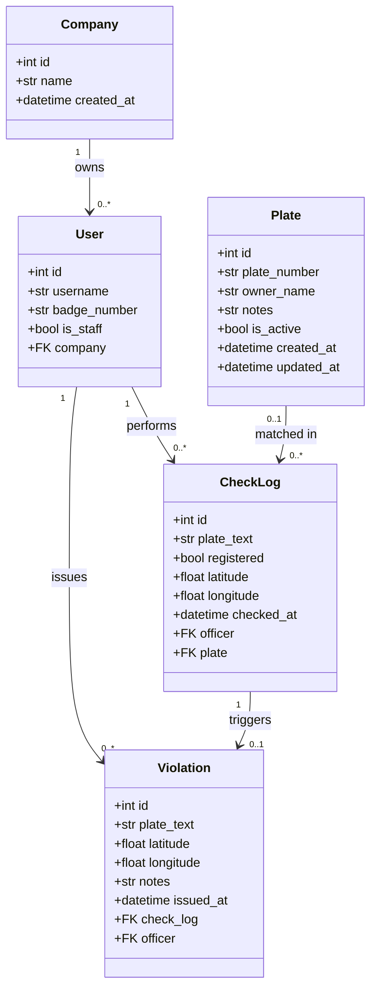
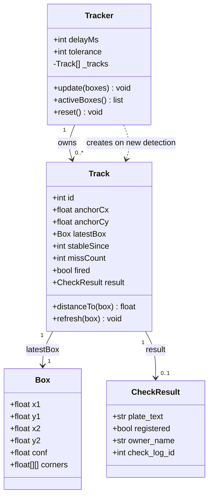

# Park Check — Licence Plate Enforcement App

---

## Dataflow

```mermaid
flowchart
    CAM[/"Camera stream\n(1280×720 @ environment-facing)"/]

    subgraph FRONTEND["Frontend — React PWA (browser)"]
        FRAME["Capture frame\nevery N=2 frames"]
        RESIZE["Resize to 640×640\nnormalise to [0,1]"]
        DET["YOLOv8n-seg ONNX\nPlate Detection\n(WebGPU → WebGL → WASM)"]
        NMS["NMS + confidence filter\nthreshold=0.4 / IoU=0.45"]
        TRACKER["Tracker\ncenter-based matching ±60 px\nstabilise 600 ms"]

        WARP["Perspective warp\n4-corner → 140×70 px crop\n(bilinear inverse-mapping)"]
        OCR["european-plates-mobile-vit-v2\nONNX — grayscale uint8\n9 slots × 37 chars → argmax"]
        DECODE["Decode plate text\nstrip padding '_'"]

        DRAW["Draw overlay on canvas\ncolour: grey / green / red"]
        PENDING[("localStorage\npending queue")]
    end

    subgraph BACKEND["Backend — Django REST API (port 8000)"]
        CHECKVIEW["POST /api/check/\nCheckView + CheckLog created"]
        PLATEDB[("PostgreSQL")]
        RESP["JSON response\n{ registered, owner_name, check_log_id }"]
    end

    CAM --> FRAME
    FRAME --> RESIZE
    RESIZE --> DET
    DET --> NMS
    NMS --> TRACKER
    TRACKER -- "stable ≥600 ms\n(first time only)" --> WARP
    WARP --> OCR
    OCR --> DECODE

    DECODE -- "online" --> CHECKVIEW
    DECODE -- "offline" --> PENDING
    PENDING -- "back online" --> CHECKVIEW

    CHECKVIEW --> PLATEDB
    PLATEDB --> RESP
    RESP --> DRAW

    TRACKER -- "every frame" --> DRAW
```

---

## Enforcement Workflow

```mermaid
sequenceDiagram
    actor Officer
    participant App as React PWA
    participant Backend as Django API
    participant DB as PostgreSQL

    Officer->>App: Open camera
    App->>App: Request GPS
    App->>App: Detect plate (ONNX/WebGPU)
    App->>App: Track — stable ≥600 ms
    App->>App: OCR plate text
    App->>Backend: POST /api/check/ { plate_text, lat, lon }
    Backend->>DB: Lookup Plate, create CheckLog
    DB-->>Backend: registered / not registered
    Backend-->>App: { registered, owner_name, check_log_id }

    alt Registered
        App->>Officer: Green box
    else Not registered
        App->>Officer: Red box + Issue Violation button
        Officer->>App: Tap box or button
        App->>Officer: Violation modal
        Officer->>App: Confirm (+ optional note)
        App->>Backend: POST /api/violations/ { check_log_id, notes }
        Backend->>DB: Create Violation
        App->>Officer: Confirmed
    end
```

---

## Data Model

```mermaid
classDiagram
    class Company {
        +int id
        +str name
        +datetime created_at
    }

    class User {
        +int id
        +str username
        +str badge_number
        +bool is_staff
        +FK company
    }

    class Plate {
        +int id
        +str plate_number
        +str owner_name
        +str notes
        +bool is_active
        +datetime created_at
        +datetime updated_at
    }

    class CheckLog {
        +int id
        +str plate_text
        +bool registered
        +float latitude
        +float longitude
        +datetime checked_at
        +FK officer
        +FK plate
    }

    class Violation {
        +int id
        +str plate_text
        +float latitude
        +float longitude
        +str notes
        +datetime issued_at
        +FK check_log
        +FK officer
    }

    Company "1" --> "0..*" User : owns
    User "1" --> "0..*" CheckLog : performs
    User "1" --> "0..*" Violation : issues
    Plate "0..1" --> "0..*" CheckLog : matched in
    CheckLog "1" --> "0..1" Violation : triggers
```

---

## Frontend Object Model

```mermaid
classDiagram
    class Tracker {
        +int delayMs
        +int tolerance
        -Track[] _tracks
        +update(boxes) void
        +activeBoxes() list
        +reset() void
    }

    class Track {
        +int id
        +float anchorCx
        +float anchorCy
        +Box latestBox
        +int stableSince
        +int missCount
        +bool fired
        +CheckResult result
        +distanceTo(box) float
        +refresh(box) void
    }

    class Box {
        +float x1
        +float y1
        +float x2
        +float y2
        +float conf
        +float[][] corners
    }

    class CheckResult {
        +str plate_text
        +bool registered
        +str owner_name
        +int check_log_id
    }

    Tracker "1" --> "0..*" Track : owns
    Track "1" --> "1" Box : latestBox
    Track "1" --> "0..1" CheckResult : result
    Tracker ..> Track : creates on new detection
```
